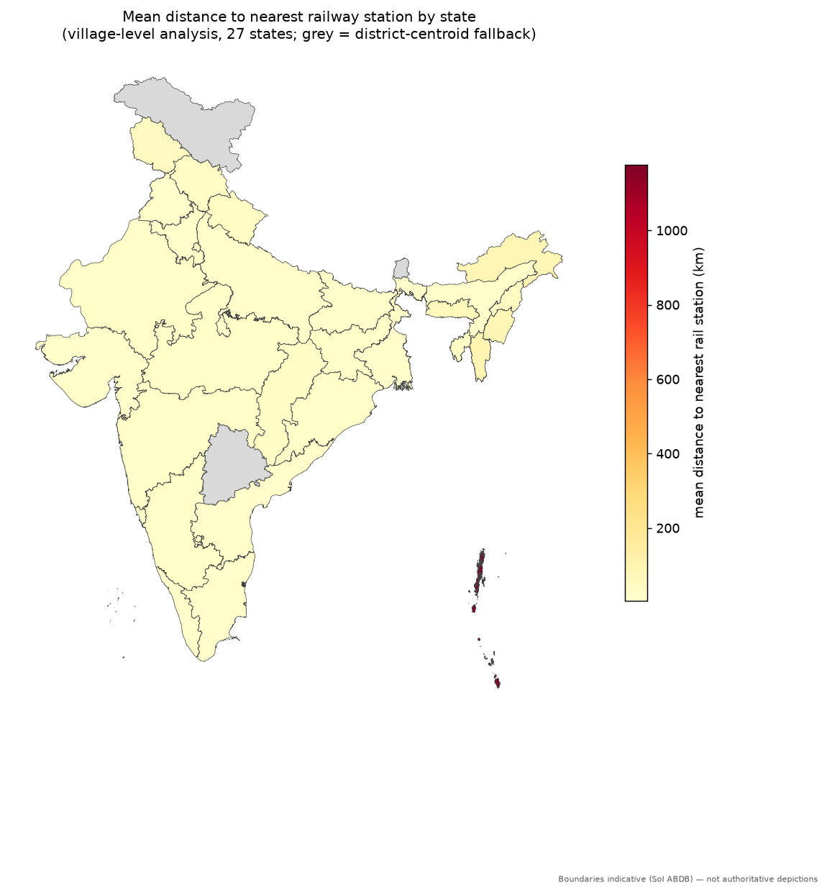
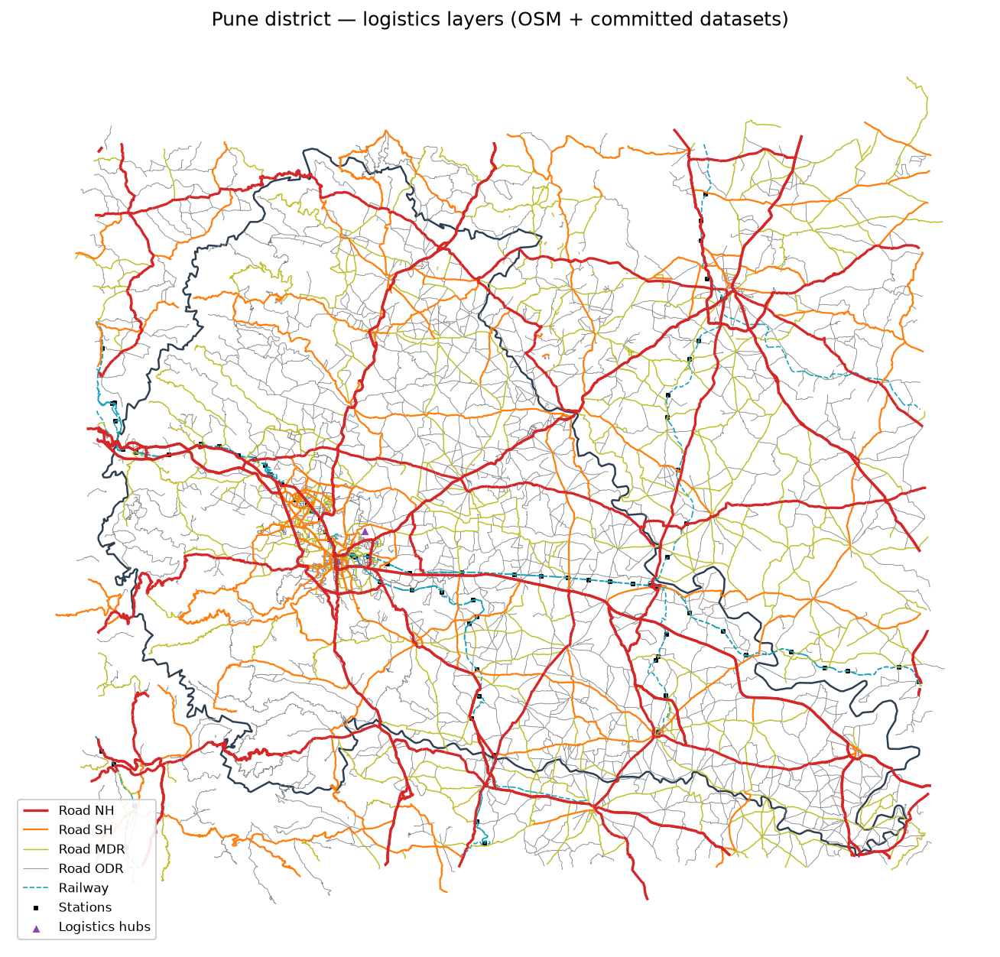

# GISIndia4Logistics

[](../../actions/workflows/ci.yml)
[](docs/USER_MANUAL.md)
[](pyproject.toml)

**GISIndia4Logistics** is an open, standardized geospatial data collection, multimodal routing, and freight analytics platform for India. Covers
administrative boundaries (India / state / district / taluka / village), roads by type,
railways (stations, freight, DFC), logistics hubs (ports, ICDs, ICPs, air cargo, MMLPs, cold chains, mandis), and
demographic indicators — plus a village-to-facility **accessibility analysis** covering
all 36 states/UTs and an integrated **FastAPI / MCP Service Engine**.

📖 **Read the Complete [User Manual & Developer Guide](docs/USER_MANUAL.md)** for detailed tutorials, Python code snippets, API reference, and desktop GIS guides.



## Quickstart (no network needed)

```python
import geopandas as gpd
import pandas as pd

districts = gpd.read_file("data/administrative/india_districts_lgd.geojson")   # 781 current LGD districts
subdists  = gpd.read_file("data/administrative/india_subdistricts_lgd.gpkg")   # 6,636 LGD subdistricts
villages  = gpd.read_file("data/administrative/villages/sikkim_soi_villages.geojson")
access    = pd.read_csv("data/analysis/india_district_access_summary.csv")     # 817 rows (all 36 states)
travel    = pd.read_csv("data/analysis/nh_district_travel_time_summary.csv")   # 781-district highway matrix
```

## Python SDK & CLI Package

Install locally in editable mode:
```bash
pip install -e .
```

### Python SDK (`import gisindia4logistics as gis`)
```python
import gisindia4logistics as gis

# 1. District logistics scorecard & demographics
pune = gis.get_district("Pune")
print(pune["nearest_highway_km"], pune["nearest_port"]["name"])

# 2. Highway shortest-path routing & FASTag tolls
route = gis.route_highway(origin=(18.5204, 73.8567), destination=(18.9500, 72.9500))
print(f"{route['distance_km']} km | {route['drive_time_formatted']} | Toll: INR {route['estimated_toll_cost_inr']}")

# 3. Multimodal freight cost optimization (Road vs Rail vs DFC)
cost = gis.calculate_freight_cost("Indore", payload_tons=24.0, road_linehaul_rate=3.80)
print(f"Optimal Mode: {cost['optimal_mode']} | Savings: {cost['modal_shift_savings_pct']:.1f}%")

# 4. Nearest logistics infrastructure (KDTree)
nearest = gis.find_nearest(latitude=28.6139, longitude=77.2090, top_k=3)
```

### Command-Line Interface (`gisindia4logistics`)
```bash
# Route & Toll calculation
gisindia4logistics route --origin 18.5204,73.8567 --dest 18.9500,72.9500 --vehicle MAV_20T

# Multimodal freight cost optimization
gisindia4logistics cost --origin Indore --payload 24.0 --road-rate 3.80

# Start REST API or MCP Server
gisindia4logistics serve --port 8000
gisindia4logistics mcp
```

## Data catalog

| Category | Dataset | Resolution | Format | Scope / How to get it |
|---|---|---|---|---|
| Administrative | **India / State / District / Sub-district — current, LGD-coded** | National → sub-district | GeoJSON/GPKG | Committed in `data/administrative/` (**36 states, 781 districts, 6,636 sub-districts**) |
| Administrative | Districts (Census 2011, for census joins) | District | GeoJSON | Committed in `data/administrative/india_districts.geojson` (640 districts) |
| Administrative | **Villages & Habitations — 100% 36 States/UTs Coverage** | Village / Settlement | GeoJSON | Committed in `data/administrative/villages/` (**578,345 settlements**: 543k SoI polygons + 35k border habitations) |
| Roads | **National Highway network (all numbered NH routes)** | National | GeoJSON | Committed in `data/roads/india_nh_network.geojson` (141,990 segments, ~634 routes) |
| Roads | **National Toll Plazas (FASTag & Highway Plazas)** | National points | CSV | Committed in `data/roads/toll_plazas.csv` (**1,536 clustered Toll Plazas** under NHAI TIS model) |
| Roads | Road network classified by type (NH/SH/MDR/ODR/village) | National | OSM PBF / GeoJSON | `scripts/fetch/fetch_roads.py` (Pune sample committed) |
| Rail | **Dedicated Freight Corridors (WDFC, EDFC & 54 DFC Junctions)** | National | GeoJSON/CSV | Committed in `data/rail/` (WDFC 1,506 km + EDFC 1,337 km + `dfc_stations.csv`) |
| Rail | **Railway stations (~8,700 stations & 5,938 categorized NSG1-6)** | National | CSV | Committed in `data/rail/` (79.3% zone coverage, operating divisions) |
| Rail | **Freight Terminals (Gati Shakti Cargo Terminals - GCT)** | National | CSV | Committed in `data/rail/freight_terminals.csv` (84 GCT freight handling terminals) |
| Logistics hubs | **Industrial Corridors (NICDC) & PM MITRA Mega Textile Parks** | National points | CSV | Committed in `data/logistics_hubs/` (21 NICDC Nodes + 7 PM MITRA Parks) |
| Logistics hubs | **Ports, ICDs, ICPs, Air Cargo, MMLPs, IWAI, FCI Depots** | National points | CSV | Committed in `data/logistics_hubs/` (247 multi-modal points) |
| Logistics hubs | **Cold Chain Storages (NCCD) & APMC e-NAM Mandis** | National points | CSV | Committed in `data/logistics_hubs/` (15 Cold Chain Hubs + 16 e-NAM Markets) |
| Freight Flows | **Annual Multi-Year Freight Series (Rail, Port, Road)** | 5 FYs (2019–24) | CSV | Committed in `data/freight/` (137 series validated vs PIB/IPA anchors) |
| Demographics | **Census 2011 & 781-District Population Allocation** | District | CSV | Committed in `data/demographic/` (1,210,846,210 population conserved) |
| Analysis | **Village Dual-Distance Accessibility Engine (all 36 States)** | Village/district | CSV | Committed in `data/analysis/` (578k village CSVs + `india_district_access_summary.csv`) |
| Analysis | **Highway Shortest-Path Drive-Time & Catchment Matrix** | 781 Districts | CSV | Committed in `data/analysis/nh_district_travel_time_summary.csv` and `nh_district_port_matrix.csv` |

The machine-readable version of this catalog is [`catalog.yaml`](catalog.yaml).
Detailed per-source documentation (URL, license, vintage, update frequency) is in
[`docs/sources.md`](docs/sources.md).

## API Server & Antigravity/Codex Plugin

GIS4Logistics includes a high-performance **FastAPI REST Server** and a native **Model Context Protocol (MCP)** server for AI agent environments:

### 1. Launch FastAPI Server
```bash
uvicorn server.app:app --host 0.0.0.0 --port 8000
```
Interactive OpenAPI/Swagger documentation is available at `http://localhost:8000/docs`.

### 2. Run with Docker Compose
```bash
docker-compose up --build -d
```

### 3. Antigravity & Codex MCP Plugin
Configure `mcp_config.json` in your agent workspace:
```json
{
  "mcpServers": {
    "gis4logistics": {
      "command": "python",
      "args": ["-m", "mcp_server.server"]
    }
  }
}
```
Available Agent Tools:
- `gis_get_district_scorecard`: Returns complete demographic, nearest highway, toll, rail, ICD, and port profiles for any of the 781 districts.
- `gis_calculate_intermodal_freight_cost`: Simulates Road vs Rail vs DFC freight costs with custom rates, tolls, and delay parameters.
- `gis_find_nearest_facilities`: Finds nearest Ports, ICDs, MMLPs, Toll Plazas, and Rail Stations to any `(lat, lon)` coordinate.
- `gis_highway_route_and_tolls`: Calculates driving distance, hours, toll counts, and FASTag toll expense.
- `gis_simulate_port_catchment`: Models national port market contestability under the Huff gravity model.
- `gis_plot_villages_map`: Generates interactive Leaflet HTML or static PNG maps of all villages in a district color-coded by accessibility.

---

## Interactive Village Mapping Engine

Generate interactive Leaflet HTML maps with mouseover popups and facility overlays, or publication-quality static PNG maps:

```bash
# Generate both interactive HTML and 300 DPI PNG map for a district
python scripts/analyze/plot_villages.py --state Haryana --district Ambala --metric dist_rail_station_km --format both
```
View directly in your browser: `http://localhost:8000/api/v1/admin/villages/map.html?state=Haryana&district=Ambala`

---

## Quickstart

```bash
pip install -r requirements.txt

# Run server and MCP verification test suite (12 tests)
python tests/test_server.py

# Run comprehensive data audit suite (75 validation checks)
python scripts/audit/audit_all.py --fast

# Build the end-to-end demo: one district, all layers merged into a GeoPackage + map
python scripts/make_demo.py --district Pune --state Maharashtra
```

Demo notebook: [`examples/district_logistics_demo.ipynb`](examples/district_logistics_demo.ipynb).



## Repository layout

```
data/            # Committed datasets (GeoJSON, GPKG, CSV)
scripts/fetch/   # Download and ETL ingestion scripts
scripts/clean/   # Standardization utilities (CRS, codes, schemas)
scripts/analyze/ # Spatial accessibility, Dijkstra routing, and cost simulation engines
server/          # FastAPI REST backend and dependency injection store
mcp_server/      # Model Context Protocol (MCP) stdio tool server
plugins/         # Antigravity / Codex IDE plugin definitions
skills/          # AI Agent skill runbooks and tool guides
tests/           # Automated verification test suite
docs/            # Source documentation, data standards, and legal compliance
catalog.yaml     # Machine-readable data catalog (42 datasets)
```

## Licensing & Legal Compliance

- **Code** in this repository: MIT (see [LICENSE](LICENSE)).
- **Data**: each dataset remains under its source's license — see `license` in `catalog.yaml` and [`docs/sources.md`](docs/sources.md):
  - **OpenStreetMap data**: ODbL (Open Database License) — "© OpenStreetMap contributors".
  - **Census & Ministry Portals (MoRTH, IPA, CBIC, AAI, NHLML, DFCCIL, FCI)**: Government Open Data License — India (GODL-India).
  - **Survey of India boundaries**: Redistributed in good faith under the 2021 DST Geospatial Guidelines regime with attribution.
- **India geospatial law**: this repository complies with the **2021 DST Geospatial Data Guidelines** (unrestricted civilian data, self-certification regime, no defence/strategic installations). See [`docs/legal_compliance.md`](docs/legal_compliance.md).
- **Boundary disclaimer**: all external and state boundaries are indicative derivatives published for logistics analytics, not authoritative Survey of India boundary certifications.

## Contributing

See [CONTRIBUTING.md](CONTRIBUTING.md). New datasets must document source, license, vintage and pass `scripts/audit/audit_all.py`.
